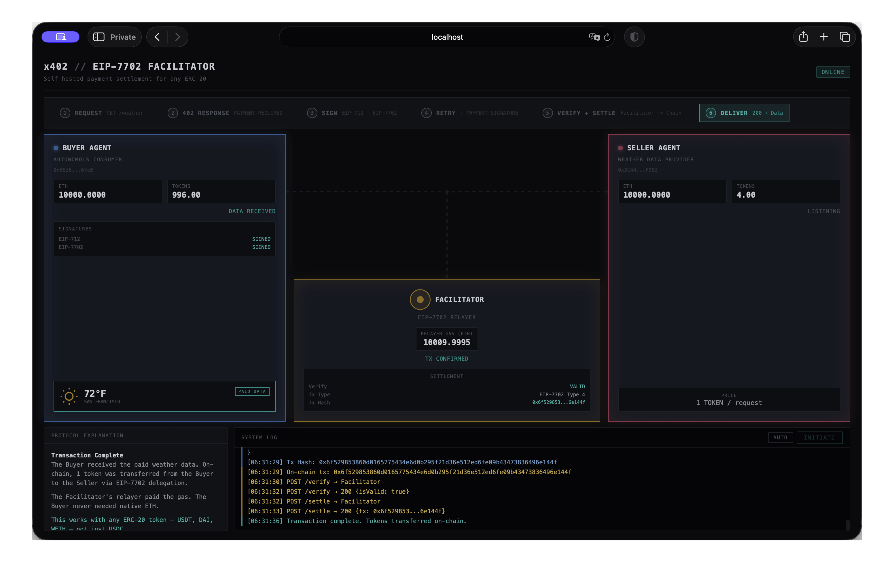

# x402 Facilitator (EIP-7702)



A self-hosted **x402 payment facilitator** that enables **any ERC-20 token** (including USDT) for HTTP 402 payments using EIP-7702 delegated transactions. Compatible with the [`@x402`](https://www.x402.org/) protocol and designed as a drop-in alternative to third-party facilitator services like Coinbase's.

```
                              x402 Payment Flow
 ┌──────────┐                                           ┌──────────┐
 │  Buyer   │─── GET /resource ────────────────────────>│  Seller  │
 │ (Client) │<── 402 + PAYMENT-REQUIRED header ─────────│ (Server) │
 │          │                                           │          │
 │          │─── GET /resource ────────────────────────>│          │
 │          │    + PAYMENT-SIGNATURE header             │          │
 │          │                                           │          │
 │          │         ┌──────────────┐                  │          │
 │          │         │  Facilitator │<─ POST /verify ──│          │
 │          │         │  (this repo) │── {isValid} ────>│          │
 │          │         │              │<─ POST /settle ──│          │
 │          │         │              │── tx receipt ───>│          │
 │          │         └──────┬───────┘                  │          │
 │          │                │                          │          │
 │          │            EIP-7702 tx                    │          │
 │          │            (on-chain)                     │          │
 │          │                │                          │          │
 │          │         ┌──────┴───────┐                  │          │
 │          │         │  Blockchain  │                  │          │
 │          │         └──────────────┘                  │          │
 │          │                                           │          │
 │          │<── 200 + data + PAYMENT-RESPONSE ─────────│          │
 └──────────┘                                           └──────────┘
```

## Why This Exists

| Feature           | Coinbase Facilitator                   | This Facilitator                                    |
| ----------------- | -------------------------------------- | --------------------------------------------------- |
| **Token support** | EIP-3009 tokens only (USDC)            | **Any ERC-20** (USDT, DAI, WETH, etc.) + native ETH |
| **Hosting**       | Third-party SaaS                       | **Self-hosted** — you control the relayer           |
| **Protocol**      | x402 v2                                | x402 v2 (fully compatible)                          |
| **Mechanism**     | `transferWithAuthorization` (EIP-3009) | **EIP-7702 delegation** + EIP-712 intents           |
| **Gas model**     | Facilitator pays gas                   | Facilitator pays gas (relayer account)              |
| **Chain support** | Fixed set                              | **Any EVM chain** via `RPC_URL_<chainId>`           |

### How EIP-7702 Enables Any ERC-20

Coinbase's facilitator relies on EIP-3009 (`transferWithAuthorization`), which is only implemented by a few tokens (notably USDC). Most tokens — including USDT, DAI, WETH — do not support it.

This project uses **EIP-7702** instead: the buyer's EOA delegates to a [`Delegate`](packages/contracts/src/Delegate.sol) smart contract that executes `SafeERC20.safeTransfer` on behalf of the user. The delegation persists after the transaction, so subsequent payments skip the authorization list and save gas. This works with **every ERC-20 token**, including non-standard ones like USDT that don't return a boolean from `transfer()`.

```
  EIP-7702 Delegation (Type 4 Transaction)

  ┌─────────────────────────────────────────────────┐
  │ Buyer's EOA (0xBuyer...)                        │
  │                                                 │
  │  Before: empty code                             │
  │  During tx: code = Delegate.sol                 │──> safeTransfer(token, to, amount)
  │  After: code persists                           │
  │                                                 │
  │  Signed: EIP-7702 authorization (delegate to)   │
  │  Signed: EIP-712 PaymentIntent (what to pay)    │
  │  Gas: paid by relayer, not the buyer            │
  └─────────────────────────────────────────────────┘
```

## Project Structure

```
packages/
├── contracts/   Delegate.sol — EIP-7702 delegation target (Foundry/Solidity)
├── server/      Facilitator server — verifies + settles payments (Bun/TypeScript)
└── agents/      Demo seller & buyer agents for testing (Bun/TypeScript)
```

| Package                            | Description                                         | Docs                                   |
| ---------------------------------- | --------------------------------------------------- | -------------------------------------- |
| [`contracts`](packages/contracts/) | Solidity smart contract for EIP-7702 delegation     | [README](packages/contracts/README.md) |
| [`server`](packages/server/)       | Self-hosted x402 facilitator with verify/settle API | [README](packages/server/README.md)    |
| [`agents`](packages/agents/)       | Demo weather-seller and autonomous buyer agents     | [README](packages/agents/README.md)    |

## Prerequisites

- [Bun](https://bun.sh/) v1.1+
- [Foundry](https://getfoundry.sh/) (`anvil`, `forge`)

## Quick Start

### Run Your Own Facilitator

```sh
# Start the server (all config via CLI flags)
bunx @facilitator/server \
  --relayer-private-key 0x... \
  --delegate-address 0x... \
  --rpc-url 1=https://eth.llamarpc.com \
  --rpc-url 8453=https://mainnet.base.org \
  --port 3000

# Or use environment variables
export RELAYER_PRIVATE_KEY="0x..."
export DELEGATE_ADDRESS="0x..."
export RPC_URL_1="https://eth.llamarpc.com"
bunx @facilitator/server
```

See [`packages/server`](packages/server/README.md) for the full CLI reference and API docs.

### Run the Demo

```sh
bun install
bun run demo
```

The demo orchestrates everything: Anvil blockchain, contract deployment, facilitator server, seller agent, and buyer agent. A web UI opens at `http://localhost:8080` after the first successful purchase.

## API Reference

### Facilitator Endpoints

| Method | Endpoint               | Description                                  |
| ------ | ---------------------- | -------------------------------------------- |
| `GET`  | `/healthcheck`         | Service status and uptime                    |
| `GET`  | `/supported`           | Supported schemes, networks, relayer address |
| `GET`  | `/discovery/resources` | Bazaar catalog (paginated)                   |
| `POST` | `/verify`              | Off-chain verification of a payment payload  |
| `POST` | `/settle`              | Verify + submit transaction on-chain         |
| `GET`  | `/balance`             | Relayer ETH balance (debug)                  |

## Testing

```sh
# Solidity unit tests (Foundry)
bun run test:contracts

# TypeScript integration tests (all workspace packages)
bun run test

# Type checking
bun run typecheck
```

## Multi-Chain Support

The facilitator supports any EVM chain. Add RPC endpoints via environment variables:

```sh
export RPC_URL_8453=https://mainnet.base.org      # Base
export RPC_URL_1=https://eth.llamarpc.com         # Ethereum Mainnet
export RPC_URL_42161=https://arb1.arbitrum.io/rpc # Arbitrum
```

Format: `RPC_URL_<chainId>`

## License

MIT
